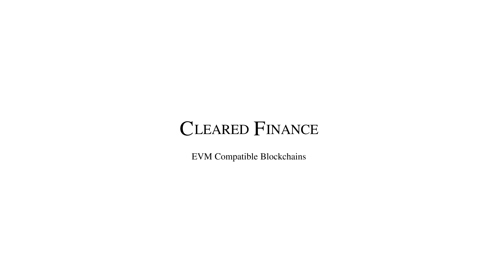

> **Warning**
> This is a work in progress and under no circumstances should be deployed in a production environment. This is a proof of concept and a proof of concept only.

Cleared Finance is designed to operate with a centrally trusted, but decentralized, clearing house for financial derivatives and this repository aims to establish the foundational building blocks that had been missing.

With inevitable regulation, the only way to operate in the financial space is to be transparent and auditable. This is the only way to ensure that the financial system is fair and equitable for all.

To be prepared for the inevitable, we must build the tools that will allow us to operate in a transparent and auditable manner without losing access to the benefits of a decentralied blockchain.

## Authors Note

If you are interested in helping (or hating) as a lawyer, developer, or investor, please reach out to me at [nftchance](https://twitter.com/nftchance) on Twitter.

> **Note**
> I am not interested in discussing CBDCs, Stablecoins, or any other financial instrument. This is a proof of concept for a clearing house and nothing more.